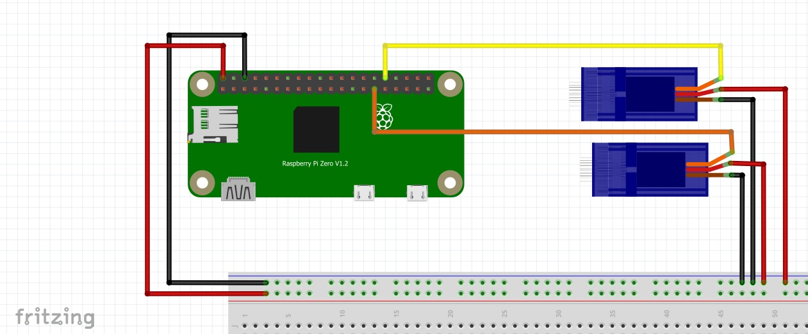
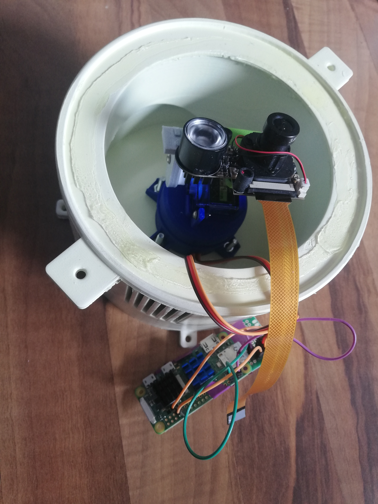
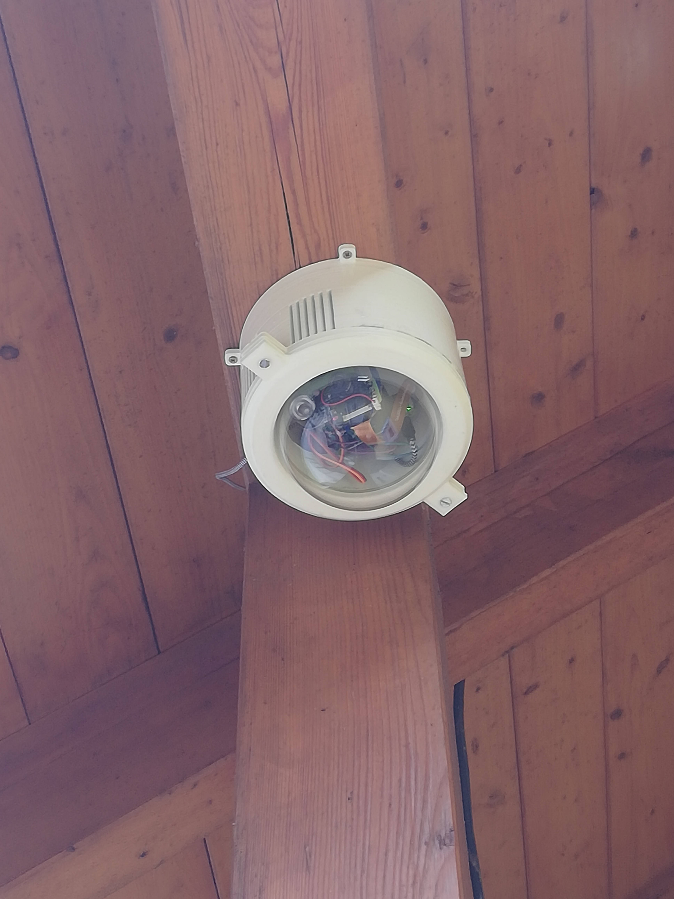

# pantiltcamera
PREVIEW VERSION! Currently WIP

This repository contains code for a camera system that can pan and tilt. Using for example motionEye and its Action Buttons, we get a user-friendly interface for managing and controlling the camera. The system is designed to be easy to set up and use.

## Table of Contents
- Description
- Installation
- Usage
- Schematic
- Pictures
- License

## Description
Pantiltcamera is a project that provides ServoController scripts to work with motionEye and create a rotatable surveillance camera system.  It is intended to be used with a rotatable turret or something similar. The class initializes a servo motor using the GPIOZero library and allows the user to move the servo to a desired angle.

## Installation
### 1. get motionEye running
Here is a short [guideline](./motionEyeInstallGuide.md) on how to set up motioneye on a Raspberry pi Zero 2 W (should work with all other boards as well).

### 2. implement motionEye's Action Buttons
possible TODO: add cmake to make install process easier

In order to make the Action Buttons work follow [this](./integratecodeandcam.md). As soon as you set up your camera (with id eg. '1') and place the file left_1 in there you should be able to see a button when you click on your camera feed on the motionEye page.

### 3. or controll it otherwise
When you're not using motionEye, the script can be still useful to control the servos. When installing the second point just skip the part where you copy files into the motionEye folder. You can always run the code from the directory of the Repositorys folder.

## Usage
The servo angle can be incremented or decremented using the up and down methods. The current servo position is saved and loaded from a JSON file specified in the class.  

In order to work with motionEye Action buttons there need to be files called left_n, right_n, up_n and down_n in the configuration folder off motionEye (the n stands for camera index). Make sure they are executable.  

Short example on how the 'moveServo.py' script works, be sure to run this from within the repository or the motionEye config folder:  
By calling the 'moveServo.py' function we have to pass function parameters containing a pin a method name and an optional angle.

    #   Pin-number method (optional angle)
    python moveServo.py 12 'up' 30
    # or
    python moveServo.py 12 'down'

 However the pin need to be configured in this python script first, by default I'm using 12 and 13. You can find this in the main block of the moveServo.py file:

    # Define the dictionary of valid pins and their corresponding directions
    # HINT: Class will validate keys in the position file to match 'horizontal or 'vertical'
    valid_direction = {12: 'horizontal', 13: 'vertical'}

## Schematic

Possible schematic:

-------------------

I hope this helps although i wont guarantee anything.

-----------------

## Pictures

## License
Pantiltcamera is released under the GPL 3.0 license.